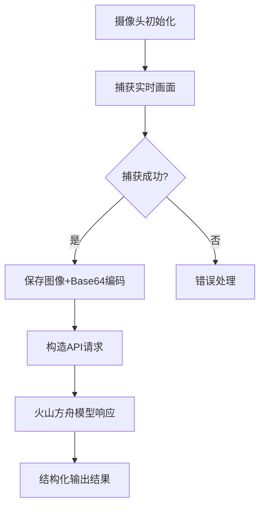

# 基于doubao-1-5-thinking-pro开发的视觉识别

## 项目概述
通过火山方舟平台的`doubao-1-5-thinking-pro`多模态大模型，实现实时摄像头画面识别与自然语言描述生成。系统可自动捕获当前摄像头画面并输出结构化场景分析。

---

## 开发环境
| 类别          | 配置                          |
|---------------|------------------------------|
| 操作系统      | Windows 11                   |
| 开发工具      | PyCharm 2023.2 (Python 3.9+) |
| 核心库        | OpenCV, volcenginesdkarkruntime |
| 模型平台      | 火山方舟（API Key验证）       |

---

## 开发思路

### 1. 环境搭建
```python
# 依赖安装（PyCharm Terminal执行）
pip install opencv-python 
pip install volcenginesdkarkruntime
pip install python-dotenv  # 推荐用于API密钥管理
```

### 2. 功能模块设计

### 3. 关键技术点
- **图像采集**：使用OpenCV的`VideoCapture`实现实时画面捕获
- **数据转换**：Base64编码满足多模态API输入要求
- **请求构造**：符合火山方舟消息格式的混合内容请求（文本+图像）
- **结果优化**：通过字符串处理实现控制台友好输出

---

## 核心代码实现

```python
# 完整代码见 src/video_analysis.py
import cv2
import base64
from volcenginesdkarkruntime import Ark

def capture_frame():
    """摄像头画面捕获与Base64转换"""
    cap = cv2.VideoCapture(0)
    if not cap.isOpened():
        raise RuntimeError("摄像头初始化失败")

    ret, frame = cap.read()
    if ret:
        cv2.imwrite("captured_frame.jpg", frame)  # 本地存档
        _, buffer = cv2.imencode('.jpg', frame)
        return "data:image/jpeg;base64," + base64.b64encode(buffer).decode()
    cap.release()

def analyze_scene():
    """调用火山方舟API进行视觉分析"""
    client = Ark(api_key='your-api-key')  # 建议使用环境变量存储密钥
    
    response = client.chat.completions.create(
        model="doubao-1-5-thinking-pro-m-250415",
        messages=[{
            "role": "user",
            "content": [
                {"type": "text", "text": "详细描述图片内容"},
                {"type": "image_url", "image_url": {"url": capture_frame()}}
            ]
        }]
    )
    
    # 优化控制台输出格式
    print("\n" + response.choices[0].message.content.strip() + "\n")

if __name__ == "__main__":
    analyze_scene()
```

---

## 关键代码解析

### 1. 图像采集模块
```python
# 硬件访问层
cap = cv2.VideoCapture(0)  # 0-默认摄像头，1-外接摄像头
```

### 2. 多模态请求构造
```python
# 符合火山方舟API规范的混合请求结构
messages=[
    {
        "role": "user",
        "content": [
            {"type": "text", "text": "描述指令"},
            {"type": "image_url", "image_url": {"url": base64_data}}
        ]
    }
]
```

### 3. 输出优化策略
```python
# 原始输出：Choice对象包含技术字段
# 优化后：提取纯文本内容并添加换行
print("\n" + response.choices[0].message.content.strip() + "\n")
```

---

## 环境依赖与配置
1. 创建`.env`文件存储API密钥：
```ini
VOLC_ACCESS_KEY=your-api-key-here
```
2. 修改代码读取环境变量：
```python
from dotenv import load_dotenv
import os

load_dotenv()
client = Ark(api_key=os.getenv("VOLC_ACCESS_KEY"))
```

---
